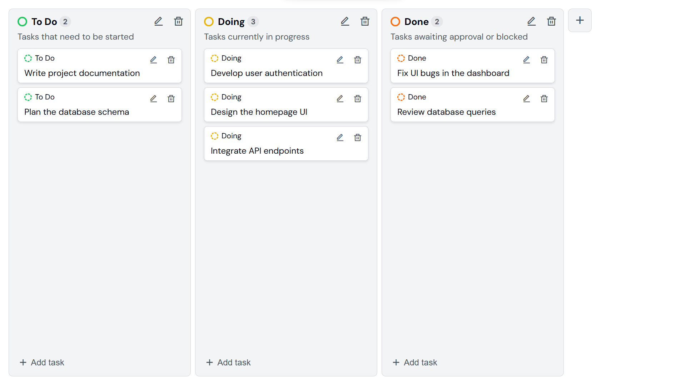

# Kanban Board

A simple and efficient Kanban Board for task management. Organize your tasks into To Do, Doing, and Pending columns for a clear workflow.

## Live Demo

[View Live Review]()

## Features

- Persistent Data Storage using LocalStorage.
- Drag & Drop Support.
- Color-coded Task Columns for easy distinction.
- Add, Edit, and Delete Tasks dynamically.

## Technologies Used

- HTML
- CSS
- JavaScript

## License

This project is licensed under the MIT License.
